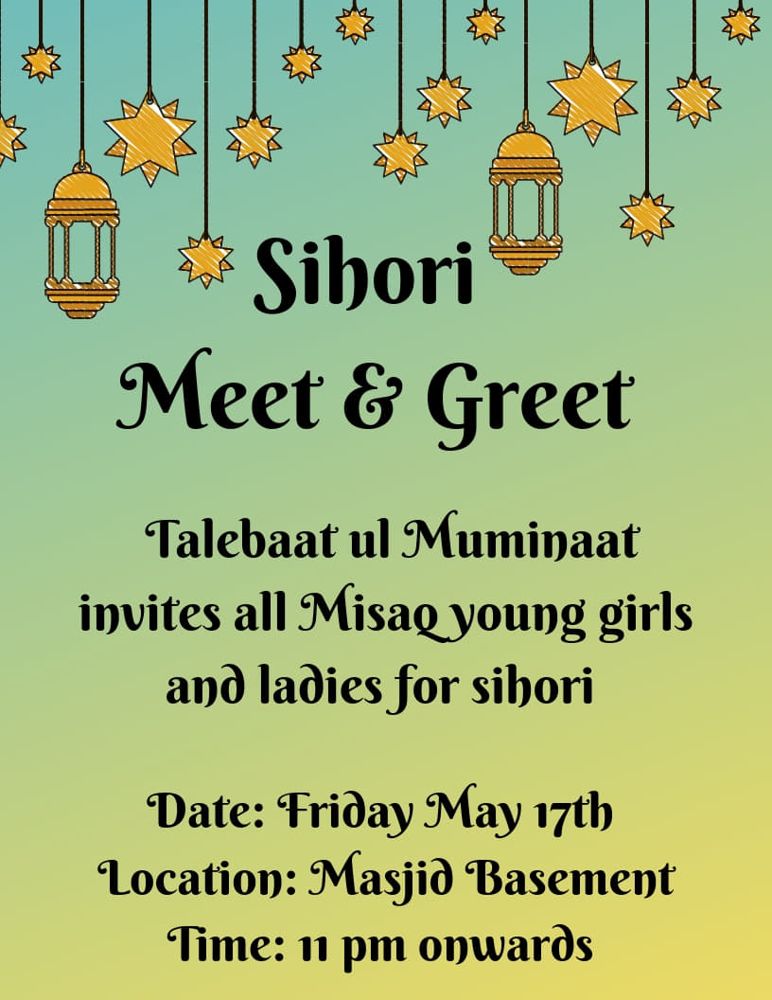

# Events 

*   Friday 6:30pm, October 25: ***Soap Making Workshop*** Come join us at a *fabulously scented soap making workshop* with our very own **Tasneem Khambata**, who will teach us the essentials necessary to make our *customized* lovely smelling soaps. The workshop will be happening in the Khambata family's store in Newmarket (and there will be snacks!).
 
Address of Store: 258 Main St. South Unit B Newmarket ON L34 3Z5
 
There's a limit of 30 spots so <a href="https://forms.gle/w3EL199UUP3tARnr7">sign up</a> now to make your very own soap for a fee of just $20!

 

We are in the middle of planning more events for the rest of this year so check here regularly!

* * *

## Past Events 

*   Friday 11:00pm, May 17: ***Sihori Meet & Greet*** @ the Masjid Basement. With the Raza of Janab Aamil Saheb - Al Talebaat ul Muminaat Toronto organization held a sehori gathering for all Misaqi girls and ladies between ages 14-30. There were games and prizes followed by behori namaz and a scrumptious sehori. Registration <a href="https://forms.gle/LwB8X867m9TNJ1Sa6">Link</a>. Everyone had an amazing time. Click <a href="https://talebaattoronto.github.io/Sihori Meet and Greet 2019">here</a> to see pics from the event!

 

*   Monday 6:30-7:30pm, July 23rd: ***SAVE THE DATE*** **EVENT** @ **34 ALEXANDRA WOOD, RICHMOND HILL**. ***Toronto and Mississauga Tauloba*** hosted a fun **interactive night** for **girls ages 15 to 35**. There were *skits and activities* which relayed the importance of our *culture* and *hijri calender*. *Kasreali bhensaabs came to bless the event and gave us all barakat.* Click <a href="https://talebaattoronto.github.io/Save The Date">here</a> to see pics from the event! 

 

*   Thursday 7pm, July 19th/ 7th Zilqad: Moulatona Fatema-tus-Zahra **MITHI SHITABI** *Ashara Ohbat Majlis* (On behalf of *Burhani Women's Association* (**BWA**)). Registration has ended. Thank you to all those who came out and made the event a success! :)

*   Wednesday Night, July 18th: **decorations for BWA event** (below) on July 19th

* * *
